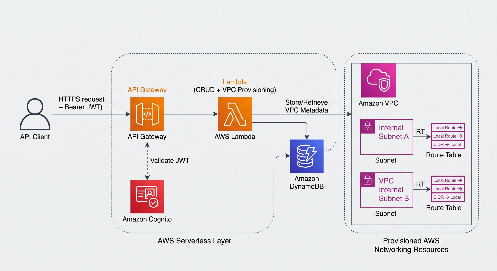

# ☁️ AWS VPC Provisioning API

[](https://github.com/rafaelhueb92/aws-vpc-provisioning-api/actions/workflows/deploy.yml)
[](https://www.python.org/)
[](https://developer.hashicorp.com/terraform)
[](https://aws.amazon.com/)
[](https://docs.astral.sh/ruff/)
[](#-tests)

Serverless API that provisions AWS networking on demand: create a VPC with its subnets, get it
back, delete it. Infrastructure is defined with Terraform, and every request is authenticated
with a Cognito JWT.

## 🏗️ Architecture



A request hits **API Gateway** with a Bearer JWT, which **Cognito** validates. The **Lambda**
then either talks to **EC2** to provision the networking resources, or reads and writes the VPC
records in **DynamoDB**.

> The diagram shows what the API provisions: the **VPC**, its **subnets** (with public IP mapping
> on the public ones), an **internet gateway** when there is at least one public subnet, and one
> **route table per subnet type** — the public one routes `0.0.0.0/0` to the internet gateway,
> the private one keeps only the local route. `DELETE` removes the route tables, the subnets, any
> attached internet gateway, the VPC and the stored records.

## 🚏 Routes

| Method   | Path             | Auth   | What it does                                                                              |
| -------- | ---------------- | ------ | ----------------------------------------------------------------------------------------- |
| `POST`   | `/vpcs`          | JWT    | Creates the VPC, its subnets, the internet gateway and the route tables, then stores them |
| `GET`    | `/vpcs/{vpc_id}` | JWT    | Returns the stored VPC                                                                    |
| `DELETE` | `/vpcs/{vpc_id}` | JWT    | Deletes the route tables, the subnets, any attached internet gateway and the VPC          |
| `GET`    | `/health`        | public | Liveness probe                                                                            |

## 📁 Project layout

```
app/                 Lambda application (Python 3.12)
  handler.py         entrypoint: handler.lambda_handler
  config/            settings read from environment variables
  models/            request validation (pydantic)
  services/          vpc.py · subnet.py · route_table.py · storage.py  (boto3)
  test/              pytest suite + fixtures
infra/               Terraform: Lambda, API Gateway, DynamoDB, Cognito, OIDC
  apigateway.tf      imports the assembled OpenAPI document as the API body
  openapi/           OpenAPI 3.0 spec, split by concern
    api.yaml         root document: openapi version + info
    paths/           one file per path, with its operations
    components/
      schemas/       one file per schema
      securitySchemes/  one file per security scheme
.github/workflows/   CI/CD: ruff + tests, then terraform plan/apply
cli/                 helper scripts: create-user.sh · generate-token.sh · vpc.md
insomnia/            Insomnia collection with the API requests (git-ignored)
permission-policy.json  IAM permissions for the CI deploy role (see Deploy role)
```

### 📄 OpenAPI spec

API Gateway imports a single document, so `infra/local.tf` assembles it at plan time from the
files above — no build step and nothing generated to keep in sync. The key *inside* each fragment
is what ends up in the document, which means the filename has no meaning: a new endpoint or schema
is a new file, and no Terraform change. Adding `paths/tags.yaml` containing `"/tags":` publishes
`/tags`; adding `components/schemas/TagRecord.yaml` containing `TagRecord:` adds that schema. Keys
must be unique across files, since the fragments are merged into one mapping.

Every fragment is also a Terraform template, so `${lambda_invoke_uri}` (the Lambda integrations),
`${cognito_issuer}` and `${cognito_client_id}` (the JWT authorizer) are substituted before the
document is imported. The body handed to API Gateway is JSON encoded from the *decoded* fragments,
so reindenting or reordering a fragment produces no diff on its own — changing a value does.

## 🚀 Deploy

**Prerequisites:** Terraform >= 1.5, AWS credentials with admin rights (for the first apply),
and an S3 bucket for the remote state.

```bash
cd infra

terraform init \
  -backend-config="bucket=<your-tf-state-bucket>" \
  -backend-config="key=vpc-provisioning-api/terraform.tfstate" \
  -backend-config="region=us-east-1" \
  -backend-config="encrypt=true"

terraform apply
```

Then read the outputs:

```bash
terraform output api_endpoint          # https://xxxxxxxx.execute-api.us-east-1.amazonaws.com
terraform output cognito_user_pool_id
terraform output cognito_app_client_id
```

**Next step — create a Cognito user and get an IdToken.** The API sits behind the Cognito
authorizer, so there is nothing to call until a user exists: [Get a token](#-get-a-token) creates
the user and exchanges it for the IdToken, then [Use the API](#-use-the-api) shows the calls.

Useful variables: `aws_region` (default `us-east-1`), `environment` (default `dev`),
`dynamodb_table_name` (default `vpc-provisioning-records`).

> The first apply must be run locally with admin credentials: it creates the GitHub OIDC
> provider and the deploy role that CI assumes afterwards. If you would rather not run the admin
> apply, create the deploy role first with the bootstrap script — see
> [Deploy role (GitHub OIDC)](#-deploy-role-github-oidc).

## 🔐 Deploy role (GitHub OIDC)

CI assumes an IAM role through GitHub OIDC, so no AWS access keys are stored in the repository.
The role can be created either way, but **pick one** — the two approaches are not meant to be
combined:

|                                    | [`oidc-github-actions-role-aws`](https://github.com/rafaelhueb92/oidc-github-actions-role-aws) | `infra/oidc.tf`                        |
| ---------------------------------- | ---------------------------------------------------------------------------------------------- | -------------------------------------- |
| Creates                            | OIDC provider (if missing) + role `GitHubActionsRole-aws-vpc-provisioning-api`                  | OIDC provider + role `vpc-provisioning-api-dev-github-actions-role` |
| Permissions                        | `permission-policy.json` from this repo                                                         | the same statements, inline in `oidc.tf` |
| Runs before                          | the first `terraform apply`                                                                     | during a local `terraform apply` with admin credentials |

### Bootstrap with the script

Prerequisites: the AWS CLI configured with credentials that can manage IAM, `jq` (the script reads
the repository metadata from the GitHub API), plus `curl` and `openssl`.

```bash
# run from the root of this repository: the script uses the folder name as the repository
# name, and reads ./permission-policy.json
export GIT_HUB_USER_NAME="rafaelhueb92"

curl -s https://raw.githubusercontent.com/rafaelhueb92/oidc-github-actions-role-aws/refs/heads/master/oidc/create-role.sh | bash
```

The script:

1. reads the AWS account ID from `sts:GetCallerIdentity`
2. creates the GitHub OIDC provider `token.actions.githubusercontent.com` if it does not exist
3. creates the role `GitHubActionsRole-aws-vpc-provisioning-api`, trusting this repository through
   `sts:AssumeRoleWithWebIdentity` on `refs/heads/main`, `refs/heads/master`, `pull_request` and
   `pull_request_target`
4. attaches `permission-policy.json` as the inline policy `GitHubActionsPolicy-aws-vpc-provisioning-api`
5. prints the role ARN

Use that ARN as the `AWS_DEPLOY_ROLE_ARN` repository secret (together with `TF_STATE_BUCKET`) and
the workflow deploys without a single long-lived key. Prefer keeping the
script inside the project? Clone the repo into `oidc/` and run `bash create-role-local.sh` instead —
it derives the repository name from the parent folder.

**What the policy grants.** `permission-policy.json` holds the same nine statements as the
terraform-managed deploy policy in `infra/oidc.tf` (`TerraformState`, `TerraformStateLock`,
`CallerIdentity`, `ManageLambda`, `ManageLambdaExecutionRole`, `BootstrapGitHubOIDCProvider`,
`ManageHttpApi`, `ManageDynamoDbTable`, `ManageCognito`) — nothing like `iam:*`, and no wildcard
actions. It is scoped to `us-east-1` and to the default resource names (`vpc-provisioning-api-dev`,
`vpc-provisioning-records`), so changing `aws_region`, `environment`, `project_name` or
`dynamodb_table_name` means editing the file:

```bash
# after editing permission-policy.json, re-apply it to the existing role
curl -s https://raw.githubusercontent.com/rafaelhueb92/oidc-github-actions-role-aws/refs/heads/master/oidc/update-role.sh | bash
```

**Things to know before running it**

- Don't bootstrap with the script and then let `infra/oidc.tf` create its own resources: terraform
  would try to create the same OIDC provider and fail with `EntityAlreadyExists`. If you take the
  script route, import the provider first
  (`terraform import aws_iam_openid_connect_provider.github arn:aws:iam::<account-id>:oidc-provider/token.actions.githubusercontent.com`)
  or drop the OIDC resources from your local apply.
- The generated trust policy accepts `pull_request` as well as `pull_request_target` subjects, so
  anyone who can open a pull request against the repository can assume the role — worth reviewing
  for a public repo.
- The script builds the `sub` condition from the repository's immutable IDs
  (`repo:owner@owner-id/repo@repo-id:...`), the format GitHub emits for repositories created on or
  after 15 July 2026, and for older ones that opted in. `infra/oidc.tf` uses the plain
  `repo:owner/repo:...` form. If a run fails with
  `Not authorized to perform sts:AssumeRoleWithWebIdentity`, compare the `sub` recorded in the
  `AssumeRoleWithWebIdentity` CloudTrail event with the trust policy of the role.
- `curl | bash` executes whatever is on `master` at the time; pin it to a tag or commit if you want
  to read the code before it touches your account.

## 🔑 Get a token

Every route except `/health` needs an IdToken issued by the User Pool that comes with the stack.
Three steps, run from the repository root.

1. Read the ids the stack created:

   ```bash
   POOL_ID=$(terraform -chdir=infra output -raw cognito_user_pool_id)
   CLIENT_ID=$(terraform -chdir=infra output -raw cognito_app_client_id)
   ```

2. Create the user and set a permanent password. The pool signs in by email
   (`username_attributes = ["email"]` in `infra/cognito.tf`) and `--permanent` confirms the user,
   so the invitation email and its code are not needed — add `--message-action SUPPRESS` to the
   first command if you would rather Cognito does not send it at all:

   ```bash
   aws cognito-idp admin-create-user --user-pool-id "$POOL_ID" --username you@example.com
   aws cognito-idp admin-set-user-password --user-pool-id "$POOL_ID" \
     --username you@example.com --password 'Passw0rd!' --permanent
   ```

3. Exchange the credentials for the IdToken. The app client allows `USER_PASSWORD_AUTH`
   (`infra/cognito.tf`), so the password flow works without SRP:

   ```bash
   aws cognito-idp initiate-auth --auth-flow USER_PASSWORD_AUTH --client-id "$CLIENT_ID" \
     --auth-parameters USERNAME=you@example.com,PASSWORD='Passw0rd!' \
     --query 'AuthenticationResult.IdToken' --output text
   ```

The IdToken is valid for 60 minutes (`id_token_validity` in `infra/cognito.tf`); send it to the API
as `Authorization: Bearer <token>`.

## 🧪 Use the API

```bash
API=$(terraform -chdir=infra output -raw api_endpoint)
TOKEN="<the IdToken from above>"

# health check (no token needed)
curl "$API/health"

# create a VPC with a public and a private subnet
curl -X POST "$API/vpcs" \
  -H "Authorization: Bearer $TOKEN" \
  -H "Content-Type: application/json" \
  -d '{
        "name": "my-vpc",
        "cidr": "10.0.0.0/16",
        "subnets": [
          {"name": "public-1",  "cidr": "10.0.1.0/24", "availability_zone": "us-east-1a", "is_public": true},
          {"name": "private-1", "cidr": "10.0.2.0/24", "availability_zone": "us-east-1b", "is_public": false}
        ]
      }'
# -> {"message": "VPC vpc-0123... created with success.", "vpc_id": "vpc-0123...", "subnet_ids": ["subnet-...", "subnet-..."]}

# get it back
curl "$API/vpcs/vpc-0123..." -H "Authorization: Bearer $TOKEN"

# delete it (removes the route tables, the subnets and any attached internet gateway)
curl -X DELETE "$API/vpcs/vpc-0123..." -H "Authorization: Bearer $TOKEN"
```

The subnets are validated before any AWS call: each CIDR must sit inside the VPC CIDR, and
subnet CIDRs cannot overlap. Bad input returns `400`; an unknown VPC returns `404`.

### 🛏️ Insomnia collection

`insomnia/Insomnia_2026-09-14.yaml` is an Insomnia v5 collection with the four requests above
(`health`, `create-vpc`, `get-vpc`, `delete-vpc`). Import it with **Application → Preferences →
Data → Import Data → From File**, or from the CLI:

```bash
insomnia import insomnia/Insomnia_2026-09-14.yaml
```

It ships with a Base Environment holding two variables, so nothing is hardcoded in the requests:

| Variable        | Example                                                          |
| --------------- | ---------------------------------------------------------------- |
| `base_url`      | `https://xxxxxxxx.execute-api.us-east-1.amazonaws.com`            |
| `authorization` | the IdToken from [Get a token](#-get-a-token), without `Bearer `  |

`create-vpc`, `get-vpc` and `delete-vpc` send it as a Bearer token; `health` needs no auth. The
`get-vpc` and `delete-vpc` URLs carry a placeholder `vpc_id` — replace it with the id returned by
`create-vpc`. The folder is git-ignored, since the exported environment can hold a live token.

## 💻 Local development

```bash
cd app
python3.12 -m venv venv && source venv/bin/activate

pip install -r requirements.txt          # runtime deps
pip install -r test/requirements.txt     # pytest, moto, ruff

# run the API: keeps credentials local, everything else comes from the env
DDB_TABLE_NAME=vpc-provisioning-records AWS_REGION=us-east-1 \
  python -c "import json, handler; print(handler.lambda_handler({'httpMethod':'GET','path':'/health'}, {}))"
```

### ⚙️ Environment variables

| Variable                                                                                             | Required | Default                   | Purpose                                              |
| ---------------------------------------------------------------------------------------------------- | -------- | ------------------------- | ---------------------------------------------------- |
| `DDB_TABLE_NAME`                                                                                     | yes      | —                         | DynamoDB table for the VPC records                   |
| `AWS_REGION`                                                                                         | no       | `us-east-1`               | Region of the clients (Lambda sets it automatically) |
| `LOG_LEVEL`                                                                                          | no       | `INFO`                    | Logger verbosity                                     |
| `AWS_ENDPOINT_URL`                                                                                   | no       | —                         | Point boto3 at LocalStack or moto instead of AWS     |
| `VPC_WAITER_DELAY` · `VPC_WAITER_MAX_ATTEMPTS` · `VPC_WAITER_ENABLED`                                | no       | `5` · `12` · `true`       | EC2 waiter tuning for VPC creation                   |
| `SUBNET_WAITER_DELAY` · `SUBNET_WAITER_MAX_ATTEMPTS` · `SUBNET_MAP_PUBLIC_IP` · `SUBNET_MAX_WORKERS` | no       | `5` · `12` · `true` · `5` | Subnet waiter, public IP and thread pool tuning      |
| `ROUTE_TABLE_MAX_WORKERS`                                                                            | no       | `5`                       | Route table thread pool tuning                       |

## ✅ Tests

```bash
cd app
python -m pytest        # 46 tests: 33 unit (fakes) + 13 lifecycle (moto)
```

The suite runs without AWS credentials: `app/test/conftest.py` injects in-memory collaborators,
and `moto` provides a fake EC2 and DynamoDB for the lifecycle tests.

```bash
ruff check .            # same command CI runs (see .github/workflows/deploy.yml)
ruff check --fix .      # apply the safe fixes
```

## 🤖 CI/CD

`.github/workflows/deploy.yml` runs on every PR and push:

1. **lint and unit tests** — `ruff check` + `pytest`, no AWS credentials needed
2. **terraform** — `plan` on pull requests, `apply -auto-approve` on push to `main`

AWS access uses GitHub OIDC, so no long-lived keys are stored in the repository.

**Repository secrets required:** `AWS_DEPLOY_ROLE_ARN` (the role created by the
[bootstrap script](#-deploy-role-github-oidc), or by `infra/oidc.tf`) and `TF_STATE_BUCKET`.
Optional variable: `TF_STATE_KEY`.
